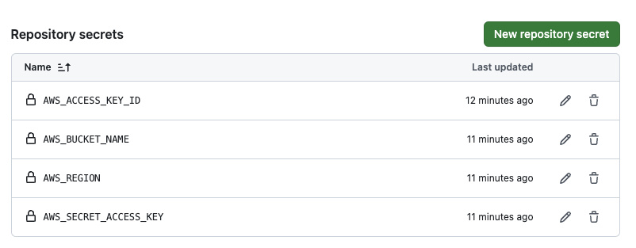

# React App with Automated Deployment to AWS S3

This project is a minimal React application that uses Parcel for bundling and includes automated deployment to Amazon S3 using GitHub Actions.

## Features

- React app bundled with `Parcel`
- Automated deployment to `AWS S3`
- GitHub Actions workflow for continuous deployment

## Setup Guide

### 1. Prerequisites
- **AWS Account**: Ensure you have an AWS account with access to create an S3 bucket.

### 2. Setting up AWS S3

Follow the detailed guide in [S3.md](./S3.md) to set up an S3 bucket for static website hosting. The guide covers enabling public access, setting up CORS, and configuring bucket policies.

### 3. Setting up GitHub Repository

**Set GitHub Secrets**:
Go to **Settings > Secrets and variables > Actions** and add the following secrets:

- `AWS_ACCESS_KEY_ID`: Your AWS Access Key ID.
- `AWS_SECRET_ACCESS_KEY`: Your AWS Secret Access Key.
- `AWS_BUCKET_NAME`: Name of your S3 bucket.
- `AWS_REGION`: Region of your S3 bucket (e.g - `ap-south-1`).

### 4. Deploy Script

The `deploy.js` script uploads the build output to S3, setting appropriate `Content-Type` headers for HTML files.
