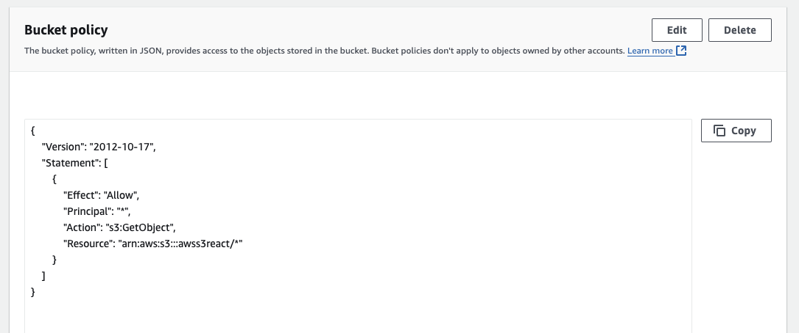

# Amazon S3 Setup

This guide provides step-by-step instructions for setting up an Amazon S3 bucket to host your React app as a static website. It includes configuring permissions, setting CORS, enabling static website hosting.

## Step 1: Create an S3 Bucket

1. Go to the [AWS Management Console](https://aws.amazon.com/console) and navigate to S3.
2. Click on **Create bucket**.
3. Enter a unique **Bucket name** and select a **Region**.
4. Under **Object Ownership**, choose **ACLs disabled**.
5. In **Block Public Access settings for this bucket**, uncheck **Block all public access** and acknowledge the warning.
6. Click **Create bucket**.


## Step 2: Enable Static Website Hosting

1. In your bucket, go to the **Properties** tab.
2. Scroll to **Static website hosting** and click **Edit**.
3. Enable **Static website hosting**.
4. Set **Index document** to `index.html`.
5. Optionally, set **Error document** to `error.html`.
6. Save changes.


## Step 3: Set Permissions with Bucket Policy

1. Go to the **Permissions** tab.
2. Scroll down to **Bucket policy** and click **Edit**.
3. Add the following policy, replacing `your-bucket-name` with your bucket’s name:

   ```json
    {
      "Version": "2012-10-17",
      "Statement": [
        {
          "Effect": "Allow",
          "Principal": "*",
          "Action": "s3:GetObject",
          "Resource": "arn:aws:s3:::your-bucket-name/*"
        }
      ]
    }
   ```

4. Save the policy.



## Step 4: Configure CORS

1. Under **Permissions**, scroll to **CORS configuration** and click **Edit**.
2. Add the following JSON configuration:

   ```json
    [
      {
        "AllowedHeaders": [
          "*"
        ],
        "AllowedMethods": [
          "GET",
          "HEAD"
        ],
        "AllowedOrigins": [
          "*"
        ],
        "ExposeHeaders": []
      }
    ]
   ```

3. Save changes.


## Final Check

Access your site using the **Static Website Endpoint** URL found in **Properties > Static website hosting**.

